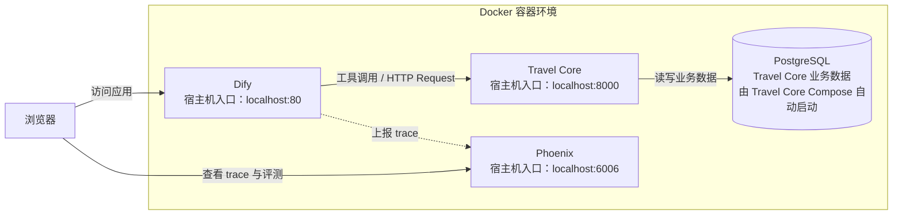

# 学员操作手册：搭建 Dify + Travel Core + Phoenix 环境

本手册带你把课程环境装起来：Dify 工作流引擎、Travel Core 业务服务、Phoenix 追踪都运行在 Docker 容器里。

> 软件/代码下载过程可能需要访问国外网络，需要提前自行解决科学上网问题。

> Mac / Windows 用 Docker Desktop。Mac 也可以改用 OrbStack 管理容器。
>
> 命令在 Mac 的 Terminal 或 Windows 的 PowerShell 里执行。

所有服务都直接从课程目录启动。后续修改源码、数据或工作流时，只在这份课程目录中操作。

## 1. 架构总览



## 2. 环境要求

| 项   | 要求                                                                   |
| ---- | ---------------------------------------------------------------------- |
| 内存 | 8 GB 起，建议 16 GB（Dify、Travel Core、PostgreSQL、Phoenix 同时运行） |
| 磁盘 | 10 GB 以上剩余                                                         |
| 系统 | macOS，或 Windows 10/11（WSL2）                                        |
| 网络 | 能访问 Docker Hub 和 GitHub                                            |

## 3. 安装容器运行时

### Mac：OrbStack

1. 官网下载 https://orbstack.dev，或 `brew install orbstack`。
2. 启动 OrbStack。
3. 验证：`docker --version` 有输出。

OrbStack 兼容 docker 命令，教程里所有 `docker` / `docker compose` 命令原样可用。

### Windows：Docker Desktop

1. 安装 Docker Desktop，选择 WSL2 后端。
2. 启动 Docker Desktop。
3. 验证：`docker --version` 有输出。

运行命令 `docker compose`（Docker Compose v2）。

## 4. 目录结构

Dify、Phoenix 和 Travel Core 的 Compose 文件都放在本目录。Travel Core 的开发配置会挂载课程根目录下的源码和数据。

```text
<课程目录>/labs/agent-platform/
  dify/           Dify 部署
  phoenix/        Phoenix 部署

<课程目录>/labs/agent-platform/travel-core/
  docker-compose.yaml       共同配置
  docker-compose.dev.yaml   本机热加载
```

## 5. 安装 Dify

Mac：

```bash
git clone --depth 1 https://github.com/langgenius/dify.git /tmp/dify
cp -R /tmp/dify/docker/. <课程目录>/labs/agent-platform/dify/
cd <课程目录>/labs/agent-platform/dify
```

Windows PowerShell 使用上游浅克隆：

```powershell
git clone --depth 1 https://github.com/langgenius/dify.git "$env:TEMP\dify"
Copy-Item "$env:TEMP\dify\docker\*" labs\agent-platform\dify -Recurse -Force
Set-Location labs\agent-platform\dify
```

### 启动

执行

```bash
cp .env.example .env
docker compose up -d
```

验证：

```bash
docker compose ps     # 所有容器 Up，db_postgres 显示 healthy
```

浏览器打开 `http://localhost`（默认端口 80），进入设置页，创建管理员账号。

## 6. 安装 Travel Core

### 本机开发：源码热加载

在课程目录内创建本机配置：

```bash
cd <课程目录>/labs/agent-platform/travel-core
cp .env.example .env
```

编辑 `.env`，替换 `POSTGRES_PASSWORD` 和 `TRAVEL_CORE_API_KEY`。后面要配置的 Dify 工作流中的 `TRAVEL_CORE_API_KEY` 需要跟这里的保持一致，。数据库密码只使用字母、数字、短横线或下划线。不管是否改动，后续相关设置都要跟它一致。

保留 `TRAVEL_CORE_ENVIRONMENT=training`。它控制课程工具目录的环境过滤，与镜像、数据库和容器采用的部署方式无关。

启动开发配置：

```bash
docker compose \
  -f docker-compose.yaml \
  -f docker-compose.dev.yaml \
  up -d --build --wait
```

检查服务：

```bash
docker compose -f docker-compose.yaml -f docker-compose.dev.yaml ps
curl http://localhost:8000/healthz
curl http://localhost:8000/readyz
```

能看到类似
`{"status":"ok","service":"travel-core"}{"status":"ready"}`

## 7. 安装 Phoenix

进入 Phoenix 子目录：

```bash
cd <课程目录>/labs/agent-platform/phoenix
```

这份 compose 已经处理了镜像的两个坑：默认入口指向系统 python，启动报 `ModuleNotFoundError`，用 `entrypoint` 覆盖成 `python -m phoenix.server.main serve`；数据卷不能挂 `/phoenix`，那里是镜像 python 环境所在，挂卷会盖住它导致 import 失败，所以挂 `/data` 并用 `PHOENIX_WORKING_DIR` 指过去。

启动并验证：

```bash
docker compose up -d
curl http://localhost:6006/     # 返回 Phoenix 页面 HTML
```

浏览器打开 `http://localhost:6006` 看到 Phoenix UI。

## 8. 配置 Dify 的 SSRF 放行

Dify 的 HTTP Request 节点走 SSRF 防护，默认拒绝私网地址。Dify 与 Travel Core 属于两个独立 Compose 项目，Dify 经宿主机发布端口访问 Travel Core（`host.docker.internal:8000`）。

在 Dify 目录（如来自克隆则是`labs/agent-platform/dify/`，否则是`labs/agent-platform/dify/dify-docker-v1.17.0`）的 `.env`：

```dotenv
SSRF_PROXY_ALLOW_PRIVATE_DOMAINS=host.docker.internal
```

改完重启 Dify 的 API、Worker、SSRF Proxy 容器。

```Shell
docker compose up -d --force-recreate ssrf_proxy api worker
```

### 8.1 （可选） 调整 Dify 知识库一次性导入的文件上限

默认一次性最多导入 5 个文件。在 Dify 目录（如来自克隆则是`labs/agent-platform/dify/`，否则是`labs/agent-platform/dify/dify-docker-v1.17.0`）的 `.env` 增加

```
UPLOAD_FILE_BATCH_LIMIT=20
```

使用已经配置好的 `docker-compose.override.yaml` 重启服务，如

```
cd labs/agent-platform/dify/dify-docker-v1.17.0
docker compose -f docker-compose.yaml -f ../docker-compose.override.yaml up -d
```

## 09. 在 Dify 中安装模型

1. 在插件市场安装 Deepseek（推荐`deepseek-v4-flash`）或智谱/Kimi 等任意模型提供商，并配置好 API key
   
   
2. 在插件市场安装硅基流动（SiliconFlow），我们会用到它免费提供的嵌入模型（`BAAI/bge-m3`）和重排模型（`BAAI/bge-reranker-v2-m3`）；但如果你有其他嵌入模型（如智谱）也可以使用
   
   
3. 在插件-模型里，设置默认选项可以方便后续配置，避免出错
   

## 常见问题

- **Dify 中安装 Deepseek 等插件报错**：与网络有关，可以通过在[插件市场](https://marketplace.dify.ai)下载，然后本地安装的方式绕过。
  
  
- **SSRF 报 "blocked by SSRF protection"，URL 却在放行列表里**：先怀疑 Dify 把 401 误报成 SSRF。Travel Core 返回 401（`TRAVEL_CORE_API_KEY` 不匹配）时，响应经过 SSRF 代理带回 squid 头，Dify 会误判。先核对 API key。
