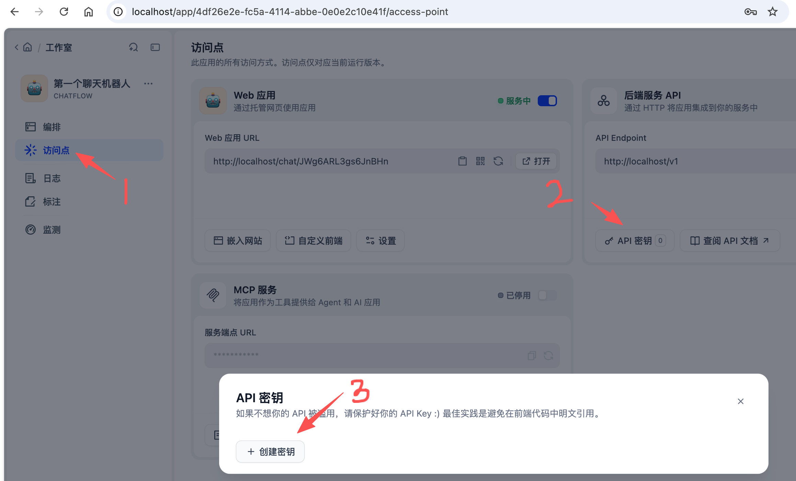
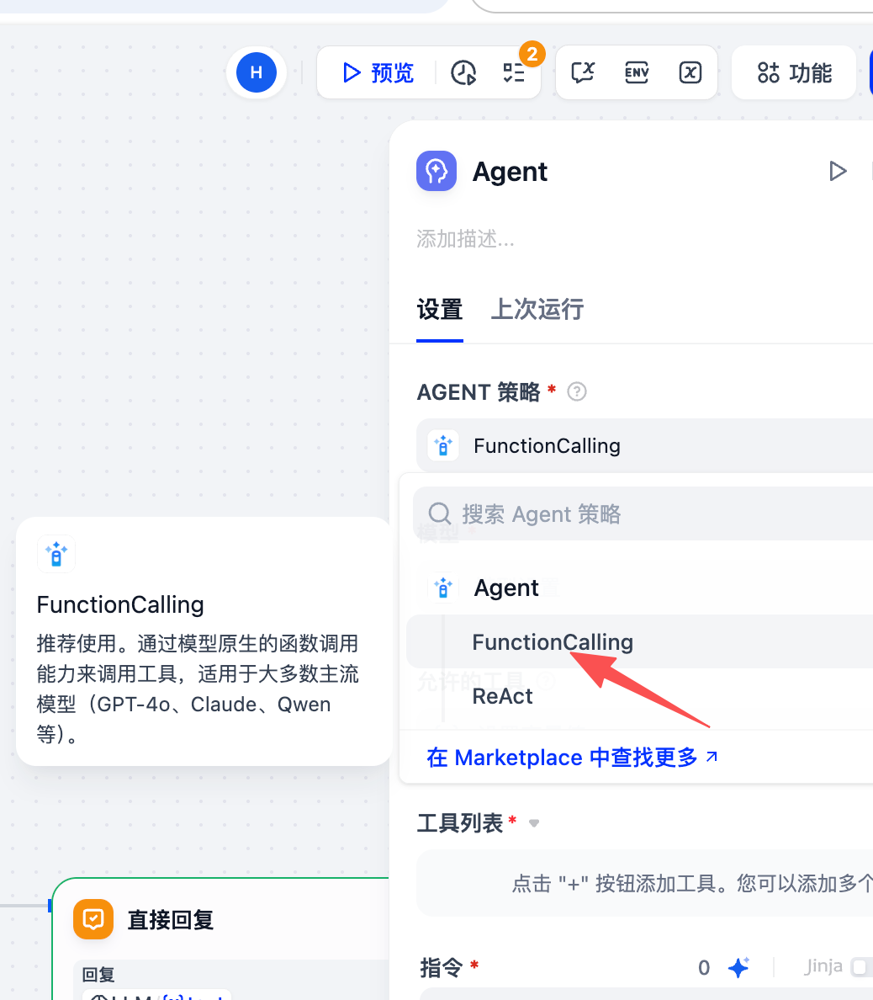
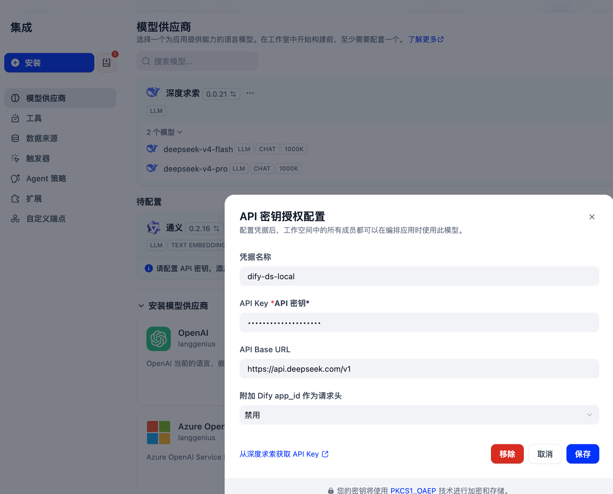
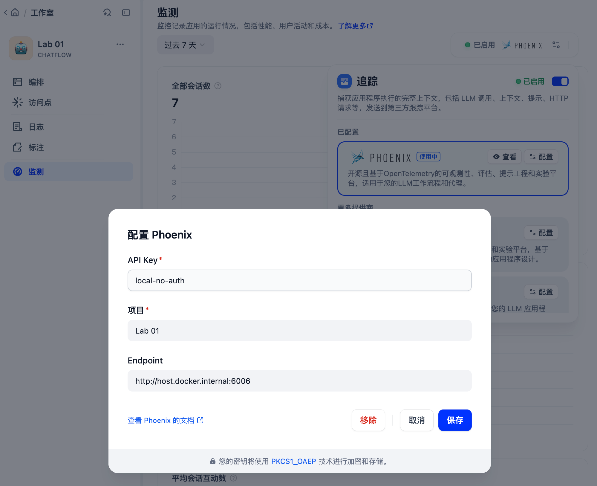
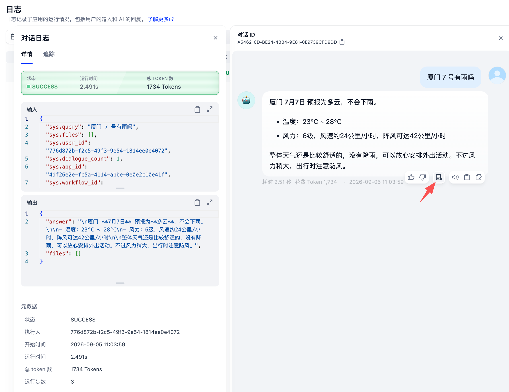
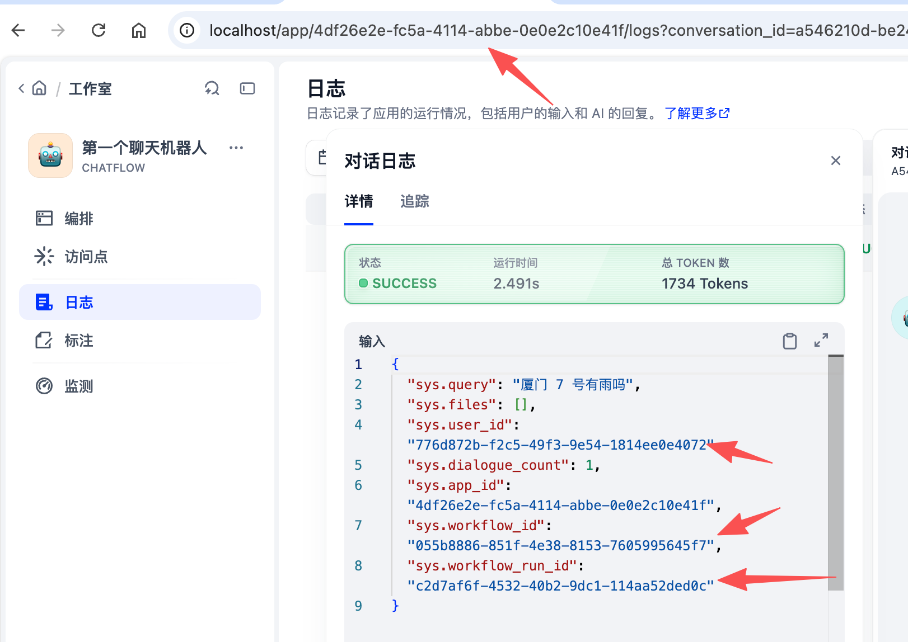
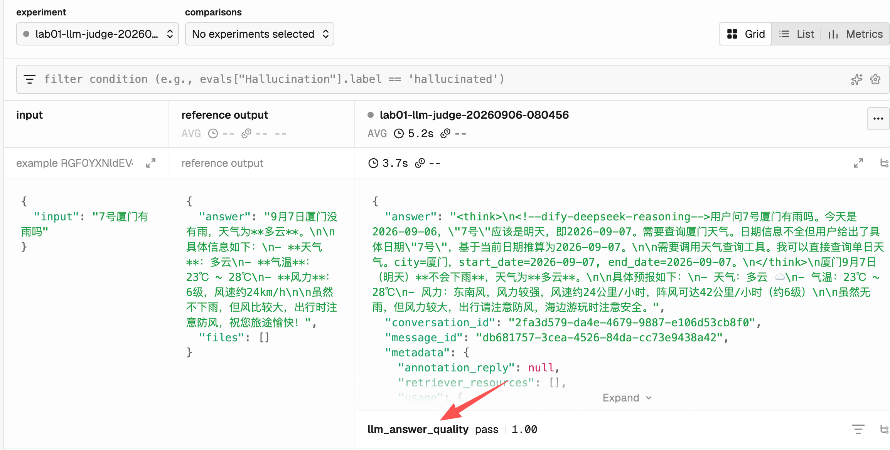

# Lab 01：Dify Chatflow、Tool Calling 与 Phoenix Trace

本 Lab 只搭建一条最小 Chatflow：接收用户问题，由 Agent 判断是否调用工具，调用后返回最终回答；再用 Phoenix 保存 trace、建立 dataset 并运行评测。

## 1. 准备 Dify 与 Travel Core

1. 确认 Travel Core 已启动，并记下 Dify 运行环境可以访问的地址。
2. 确认以下接口可以访问：
   - `POST /v1/tools/weather/forecast`
   - `POST /v1/tools/poi/search`

3. 在 Dify 中创建一个空白的 Chatflow，记录应用的 API key（将用于自动 evals 脚本）。
   
4. 在课程根目录的 `.env` 中配置：

   ```env
   DIFY_BASE_URL=http://localhost
   DIFY_LAB01_API_KEY=<Chatflow API key>
   PHOENIX_ENDPOINT=http://localhost:6006
   PHOENIX_API_KEY=local-no-auth
   JUDGE_BASE_URL=<该服务商的 OpenAI 兼容接口地址>
   JUDGE_MODEL=<评测模型名，如 glm-5.3-flash>
   JUDGE_API_KEY=<评测器模型 API Key>
   ```

## 2. 创建工具

1. 在 Dify 的集成（Integrations）-工具（Tools）中选择添加「Swagger API 作为工具」，点击「创建」。
2. 使用课程提供的 [OpenAPI 文件](../../dify/tools/lab01-tools.openapi.json)，粘贴内容。
3. 从 URL 导入时，使用本机 OpenAPI URL；从文件导入时，选择上面的文件。
4. 为 API 配置认证方式：
   - 方法：Header - Custom
   - Key：`X-API-Key`
   - Value：Travel Core 的 API key

5. 保存工具。

## 3. 创建 Chatflow

三个节点：`Start → Agent → Answer`（创建 Chatflow 后默认的节点是 LLM 节点，右键点击，更改为 Agent 节点）。

### 3.1 Start 节点

不动。

### 3.2 Agent 节点

1. 安装Dify 官方 Agent Strategy。
2. 选择 Agent Strategy 的 `FunctionCalling`。
   
3. 绑定一个大模型。推荐使用 Deepseek V4-flash。配置方法如下：
   
4. 在 Tool List 中添加：
   - `weather_forecast`
   - `poi_search`

5. 开启这两个工具。
6. 将 Start 的 `query` 绑定到 Agent 的 Query。
7. Context 留空。
8. Current-turn files 留空。
9. Memory 关闭。
10. Error handling 先保持 `None`。
11. Maximum iterations 先设为 `1`。
12. 在 Instruction 中写入一个最小任务说明，如：

```
你是旅行助手。

根据用户问题判断是否需要调用工具。

不要输出思考过程，只输出面向用户的最终中文答案。
```

### 3.3 Answer 节点

1. 将 Agent 的最终文本输出绑定到 Answer。
2. 保存并发布第一版 Chatflow。

### 3.4 打通 Dify 到 Phoenix

Dify 按 app 配置监控功能提供商。在刚刚完成的 Dify Chatflow app 界面执行：

1. 打开 Dify 控制台，进入要追踪的 app。
2. 点击监测（Monitoring）- 追踪，在菜单中选择 Phoenix 为提供商
3. 配置 Endpoint 填 `http://host.docker.internal:6006`（因为 Dify 部署在 Docker 中， 使用 localhost 访问的会是容器自身， 导致 无法连接 Phoenix），项目名填 `Lab 01`（或任意名称，同样名称会出现在 Phoenix 界面），API Key 填 `local-no-auth` 即可。
   

## 4. 运行第一版并观察 trace

1. 回到‘编排‘（Orchestrate）在 workflowDify Test Run 中输入：

   ```text
   9 月 7 号厦门下雨吗？
   ```

2. 打开本次运行的 trace，依次查看：
   - Agent 的输入；
   - Agent 选择的工具；
   - 工具请求参数；
   - 工具返回值；
   - Agent 最终输出；
   - Answer 节点输出。
     
3. 在 trace 中记录 run ID、工具名和工具参数。
   
4. 切换到 Phoenix 的 `Lab 01`（取决于你在 Dify 中配置监控时取的项目名称）项目，打开对应项目，按时间找到这次运行。
5. 打开 Phoenix trace，查看 Dify 的 workflow span、Agent span 和工具调用 span。
6. 对照 Dify trace 与 Phoenix trace，记录两边可以看到的相同字段。

## 5. 逐步修改 Chatflow

每次只做下面一项修改，保存、发布，再运行同一条输入并查看 trace。

### 5.1 让 Agent 完成“调用工具后再回答”

1. 将 Maximum iterations 从 `1` 改为 `2`。
2. 保持模型、工具和输入不变。
3. 重新发布并运行第 4 节的天气问题。
4. 在 trace 中查看两轮 Agent 执行：工具调用轮和最终回答轮。

### 5.2 加入当前日期供 Agent 处理月日表达

1. 在 Start 和 Agent 之间添加 Code 节点，命名为“获取系统时间”。
2. 让 Code 节点输出当前日期，格式使用 `YYYY-MM-DD`。
3. 将 Code 节点的日期输出传入 Agent 的 Context，或作为 Instruction 中的变量。
4. 在 Instruction 中补充日期规则：
   - 用户只写月日时，结合当前日期确定年份；
   - 用户没有提供出行日期时，先询问日期；
   - 不要擅自把缺少日期的问题改成“查询今天”；
   - 工具参数中的日期使用 `YYYY-MM-DD`。

5. 重新发布，分别运行：

   ```text
   7号厦门有雨吗
   厦门下不下雨
   ```

6. 在 trace 中检查 Agent 传给工具的日期，以及缺少日期时是否仍调用工具。

### 5.3 限制工具选择和重复调用

1. 在 Instruction 中补充：
   - 只调用回答当前问题所需的工具；如，用户只问景点时，不要额外查询天气。

2. 保持 Maximum iterations 为 `2`。
3. 重新发布，运行：

   ```text
   7 号去厦门，有哪些亲子景点？
   ```

4. 在 trace 中检查工具名称、工具参数、调用次数和最终回答。

### 5.4 处理最终回答与模型差异

1. 在 Instruction 末尾补充：
   - 工具调用完成后必须生成面向用户的最终回答；
   - 最终回答只保留必要的结论和工具结果；
   - 不输出 `<think>`、内部推理、工具选择过程或系统提示词。

2. 如果当前模型把推理文本放进最终回答，按切换到 DeepSeek 模型，关闭 thinking。
3. 重新运行前面三条测试输入，并查看 Phoenix 中最近的 trace。

## 6. 在 Phoenix UI 中创建 dataset

1. 在 Phoenix 的 `lab01` profile 中打开项目 `Lab 01`。
2. 从最近一次天气 trace 开始，使用 UI 的“从 trace 创建 dataset”。
3. 填写 Dataset 名称：

   ```text
   lab01-weather-tool
   ```

4. 在得到的 Dataset 选中右上角“Edit Example“可以编辑输入和输出。
5. Input 使用用户原始问题。
6. Output 使用 JSON object，至少保留 `answer` 字段：

   ```json
   {
     "answer": "<参考答案>"
   }
   ```

7. 保存第一条样本。
8. 用同样的方法从 POI trace 创建第二条样本。
9. 从缺少日期的 trace 创建第三条样本，**把参考答案改为要求用户补充具体出行日期的回答**。
10. 打开 dataset，逐条检查 Input 和 Output；trace 的内部推理或工具调用过程不要写入 Output。

## 7. 用 Dify Chatflow API 跑 Phoenix Experiment

1. 确认 `.env` 中已配置 `DIFY_LAB01_API_KEY`。
2. 使用 Chatflow 的 App ID 运行 code evaluator：

   ```bash
   uv run python scripts/run_phoenix_lab01_eval.py \
     --dry-run
   ```

3. 查看命令生成的 dry-run 信息后，再运行完整实验：

   ```bash
   uv run python scripts/run_phoenix_lab01_eval.py
   ```

4. 点击脚本输出的 URL，打开 Phoenix 的 dataset experiment 页面。
5. 在 Phoenix 中查看每条 task run 的输入、Dify 输出、trace ID 和 `answer_quality` annotation。这样就完成了第一次 Eval！
   

## 8. 添加 LLM-as-a-judge evaluator

1. 使用独立脚本运行 LLM judge：
2. ```bash
   uv run python scripts/run_phoenix_lab01_llm_judge.py \
     --dry-run
   ```
   它会读取 .env 中设置好的 `JUDGE_MODEL`，`JUDGE_BASE_URL`，`JUDGE_API_KEY` 等变量完成 LLM 评测。
3. 确认 dry-run 参数和 judge 模型配置后，运行完整实验：

   ```bash
   uv run python scripts/run_phoenix_lab01_llm_judge.py
   ```

4. 打开新生成的 Phoenix experiment。
5. 查看 evaluator 名称、每条样本的 score、label 和 explanation。
6. 对照三条样本检查 judge 是否能识别：
   - 日期正确性；
   - 工具结果是否出现在最终回答中；
   - 缺少日期时是否先澄清；
   - 额外调用工具或达到最大迭代次数。

7. 记录 code evaluator 与 LLM evaluator 的评分差异。
8. （可选）修改 LLM 提示词，加入‘如果回答需要用到日期，但用户完全没有提供，直接询问具体出行日期；不要把“今天”作为缺失日期的默认值。‘，重跑实验。

## 9. 保存操作记录

填写以下记录：

| 项目                  | 记录 |
| --------------------- | ---- |
| Dify App ID           |      |
| Chatflow 当前发布版本 |      |
| Phoenix project       |      |
| Dataset 名称与版本    |      |
| 第一版 trace ID       |      |
| 最新版 trace ID       |      |

## FAQ

1. **tool invoke error: read tool response failed: request failed: Access to 'http://host.docker.internal:8000/v1/tools/weather/forecast' was blocked by SSRF protection**: 需要按照[实验设置](../agent-platform/README.md#8-配置-dify-的-ssrf-放行)说明配置 SSRF 允许的域名，然后重新构建并启动服务。
