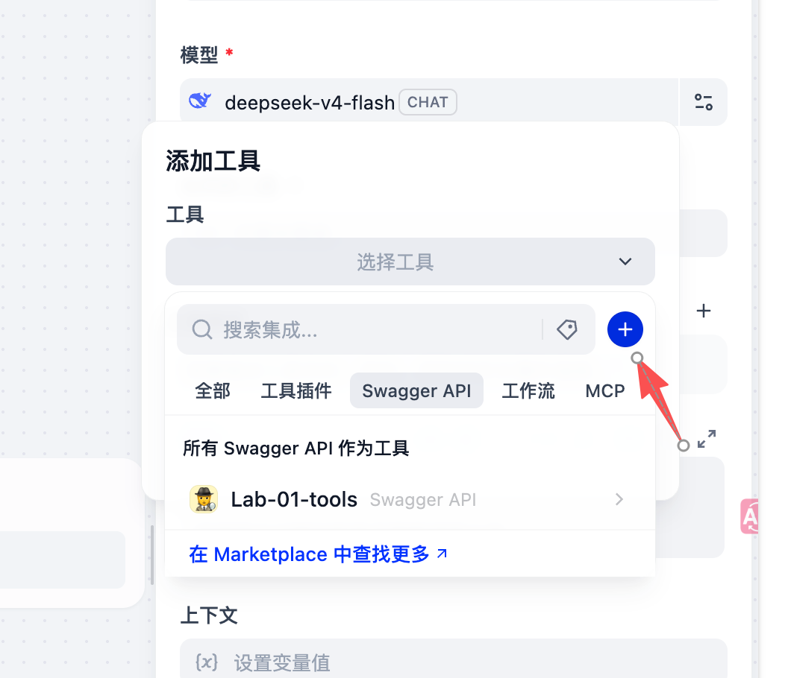
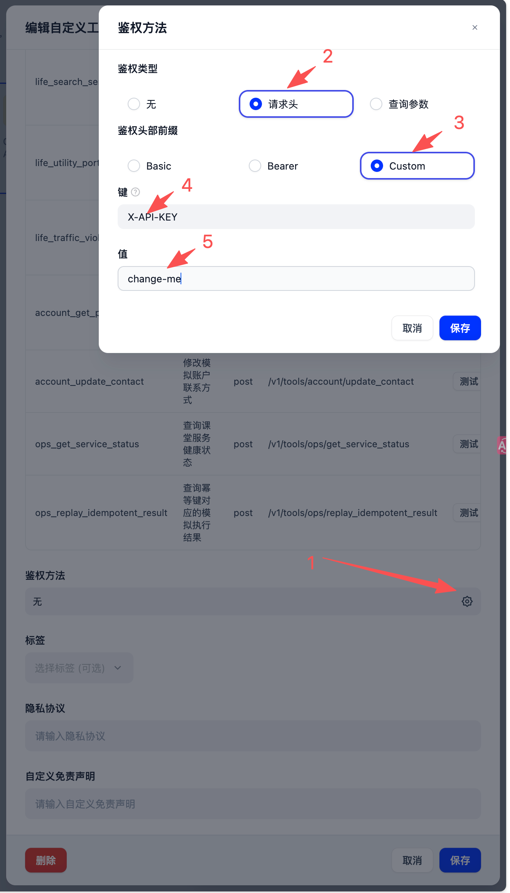
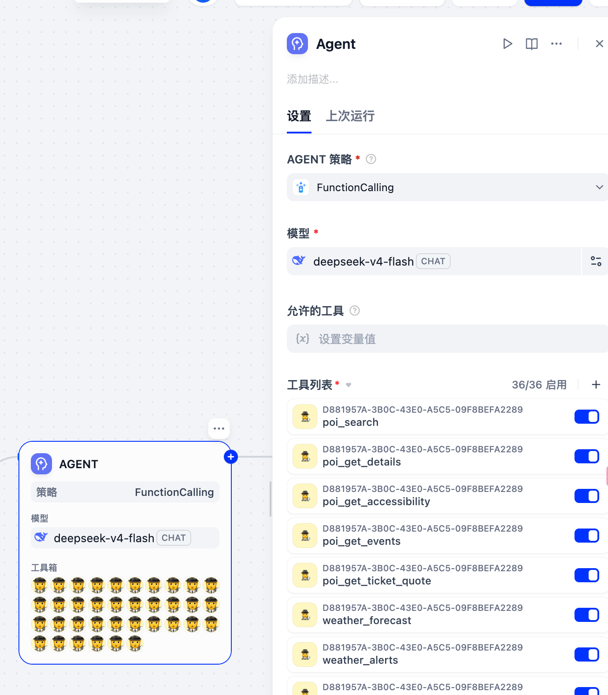
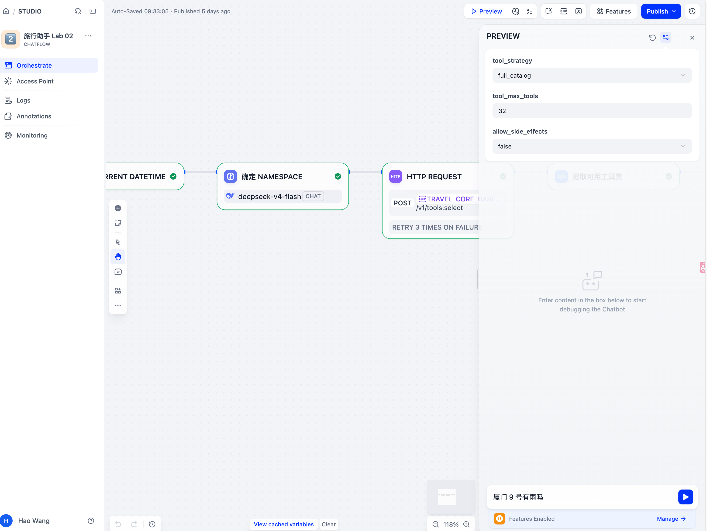
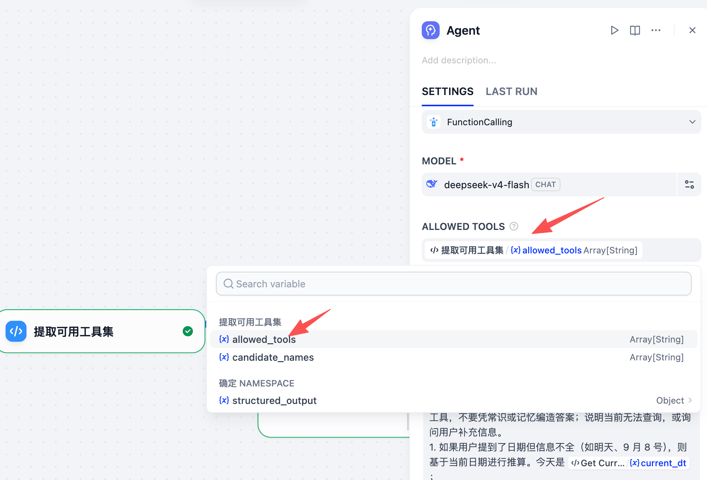

# Lab 02：大工具集过滤与受控 Tool Calling

本实验从 Lab 01 的工作流复制开始。先让 Agent 直接使用 Travel Core 提供的全部工具，再把工具选择拆成两步：

```text
用户请求
  → Travel Core 规则过滤
  → 候选工具选择
  → Agent.allowed_tools
  → Agent 继续选择工具、生成参数并执行
```

你会先看到全量工具进入 Agent 的效果，再通过 Phoenix trace 比较 `full_catalog`、`namespace` 和 `retrieval` 三种候选策略。

## 完成标准

完成本 Lab 后，你应能：

- 区分工具的静态 Tool List 和运行时 `allowed_tools`；
- 说明为什么大工具集要先经过规则过滤；
- 使用没有工具权限的 LLM 节点判断业务 namespace；
- 通过 Phoenix trace 解释三种候选策略对工具数量和 Schema 上下文的影响。

## 准备工作

参考 [AgentPlatform 文档](../agent-platform/README.md)，确认以下服务已经可以访问：

- Dify；
- Phoenix；
- Travel Core。

## 实验一：初始化 Lab 02 工作流

### 1. 复制工作流

1. 打开 Dify。
2. 复制工作流 `Lab 01`。
3. 将副本改名为 `Lab 02`。
4. 设置监控 - 追踪应用性能，设置项目名为 `Lab 02`。
5. 保存并发布一次副本。

先确认复制后的工作流仍能完成 Lab 01 的天气查询。

使用以下输入：

```text
7 号厦门有雨吗
```

在 Dify 和 Phoenix 中分别确认：

- Agent 被执行；
- Agent 能调用天气工具；
- 工具返回值回到了 Agent；
- 最终回答来自工具结果；
- Phoenix 中能找到本次运行。

## 实验二：让 Agent 认识完整工具目录

导入和调用 Travel Core 的工具。

### 1. 从 OpenAPI URL 导入工具

1. 打开工作流 Agent 节点，在 Tool list 参数处点击“+”。
   
2. 在打开的弹窗中，选择通过 URL 导入 OpenAPI 工具。
3. 填入：

   ```text
   http://host.docker.internal:8000/v1/tools/openapi.json
   ```

4. 选择认证方式：Header，Custom，key: `X-API-KEY`，value：<你的 TRAVLE_CORE_API_KEY>（在 .env 里有这个值；默认是`change-me`）
5. 导入并检查工具数量、工具名称和请求地址。
   

导入结果应包含 Travel Core 当前工具目录中的工具。课程目录当前为 36 个工具，包含 `weather`、`poi`、`mobility`、`stay`、`itinerary` 等业务 namespace。


### 2. Tool List

1. 确认工具全部启用。
2. 保持 Agent Strategy 为 `FunctionCalling`。

此时的结构仍然是：

```text
Start → Code → Agent → Answer
```

### 3. 验证完整工具列表

再次运行：

```text
7 号厦门有雨吗
```

检查 Agent 是否能够调用：

```text
weather_forecast
```

如果调用无误，记录：

- Dify Agent 的 Tool List 数量；
- Agent 实际调用的工具；
- 工具参数中的城市和日期；
- Phoenix trace 中的 Agent 输入和工具调用。

## 实验三：增加 Travel Core 候选选择节点

把工具选择从 Agent 中提前出来。Travel Core 负责可信规则过滤和候选生成，Agent 只处理候选集合。

### 1. 调整工作流连线

在 Code 和 Agent 之间增加 HTTP Request 节点：

```text
Code → HTTP Request（select tools）→ Agent → Answer
```

### 2. 创建工作流输入变量

在「用户输入 / Start」节点手动添加以下变量：

| 变量名               | 类型     | 选项                                     | 初次测试值     |
| -------------------- | -------- | ---------------------------------------- | -------------- |
| `tool_strategy`      | 下拉选项 | `full_catalog`、`namespace`、`retrieval` | `full_catalog` |
| `max_tools`          | 数字     | —                                        | `35`           |
| `allow_side_effects` | 复选框   | `true`、`false`                          | `false`        |

将这三个输入设为必填。在运行预览的输入表单中填写初次测试值；如果界面支持默认值，也可以预先设置。用户的聊天问题仍通过 `sys.query` 传入，不需要另建问题输入变量。

`tool_strategy` 控制 Travel Core 如何筛选候选工具，不是 Agent 节点的 Agent Strategy。Agent 仍使用 FunctionCalling。

### 3. 配置 HTTP Request

请求方法和地址：

```text
POST <TRAVEL_CORE_BASE_URL>/v1/tools:select
```

请求头至少包含：

```text
Content-Type: application/json
X-API-Key: <TRAVEL_CORE_API_KEY>
X-Permissions: travel.read
```

请求体先使用变量：

```json
{
  "task": "<用户输入.query>",
  "strategy": "<tool_strategy>",
  "max_tools": <max_tools>,
  "allow_side_effects": <allow_side_effects>
}
```

其中

- `task` 来自用户原始问题，通过变量选择引用用户输入的 query；
- `strategy` 引用用户输入节点的 `tool_strategy`，`max_tools` 和 `allow_side_effects` 引用同名变量；

保留 `task` 和 `strategy` 值外层的双引号；`max_tools` 和 `allow_side_effects` 值外层不要加引号。运行后检查 HTTP 节点实际请求体，确认数字和布尔值没有变成字符串。

初次测试可以使用默认值


### 4. 观察规则过滤结果

在 HTTP 响应中重点查看：

```json
{
  "counts": {
    "catalog": 36,
    "eligible_after_hard_filter": 22,
    "selected": 22
  },
  "selection_trace": {
    "estimated_schema_chars": 10358
  }
}
```

36 个目录工具先经过权限和副作用等确定性规则，只有 22 个进入后续候选阶段。

### 5. 将候选工具传给 Agent

接下来把这个白名单传给 Agent，只能在这里面选工具。Agent 支持`allowed_tools`参数，这是一个字符串数组，所以需要变换一下。

一个细节是 Travel Core 返回工具名字格式如：

```text
weather.forecast
```

名字中带点的工具名，Deepseek 等 LLM 不支持，因此需要把名称转换为：

```text
weather_forecast
```

参考代码为

```python
import json


def main(body: str, status_code: int) -> dict:
    status_code = int(status_code or 0)

    if not 200 <= status_code < 300:
        raise Exception(f"select API 请求失败，HTTP {status_code}: {body}")

    data = json.loads(body or "{}")

    candidate_names = data.get("candidate_names") or []

    if not candidate_names:
        tools = data.get("selected_tools") or []
        candidate_names = [
            item["name"]
            for item in tools
            if isinstance(item, dict) and item.get("name")
        ]

    candidate_names = [
        str(name) for name in candidate_names if name
    ]

    allowed_tools = [
        name.replace(".", "_")
        for name in candidate_names
    ]

    has_tools = True if allowed_tools else False

    return {
        "has_tools": has_tools,
        "allowed_tools": allowed_tools,
        "candidate_names": candidate_names,
        "selected_count": len(candidate_names),
        "error": None if has_tools else "没有可用工具，无法回答"
    }
```

将 HTTP 返回的候选工具名称转换为 Dify 工具名称，并把结果绑定到 Agent 的：


Allowed Tools 类型为 `Array[String]`

### 6. 先运行天气问题，记录候选不足

先使用 `retrieval` 策略运行：

```text
7 号厦门有雨吗
```

观察 trace，按以下顺序看：

```text
HTTP Request
  → candidate_names
  → Code/解析节点输出的 allowed_tools
  → Agent 输入中的 allowed_tools
  → Agent 实际 tool call
```

会发现是因为 HTTP 请求没有得到可用的工具，`inferred_namespaces`是空数组。

## 实验四：用无工具的 LLM 判断业务 namespace

仅靠任务文本检索可能无法稳定处理相近意图。增加一个只负责业务路由的 LLM 节点。

### 1. 增加 `确定 Namespace` 节点

把节点放在 HTTP Request 前：

```text
Start → 确定 Namespace → HTTP Request → Agent → Answer
```

这个 LLM 节点：

- 不绑定任何工具；
- 不允许 Function Calling；
- 只根据用户问题判断业务 namespace；
- 输出结构化 JSON。

输出格式：

```json
{
  "namespaces": ["weather"]
}
```

将下面的内容填入 LLM 节点的 System Prompt：

```text
你是业务工具 Namespace 路由器。

你的任务只有一个：根据用户请求判断可能涉及哪些业务领域。

你不负责权限判断，不负责选择具体工具，也不能调用任何工具。

可选 Namespace 只有：

- poi：景点
- weather：天气
- mobility：交通
- stay：酒店住宿
- itinerary：行程和预算
- booking：预订、取消、退款
- life：生活服务
- account：账户和联系人
- ops：系统运维

规则：

1. 可以返回一个或多个 Namespace。
2. 用户只表达天气、下雨、温度、风力等意图时，返回 weather。
3. 用户询问景点、亲子游、活动、门票或无障碍时，返回 poi。
4. 用户询问火车、飞机、公交、地铁、轮渡或路线时，返回 mobility。
5. 用户询问酒店、入住、退房或房价时，返回 stay。
6. 用户询问行程、路线安排或预算时，返回 itinerary。
7. 用户询问订单、取消、退款或预订时，返回 booking。
8. 不确定或不需要外部工具时，返回空数组。
9. 不要根据权限判断是否返回 Namespace。
10. 只输出 JSON，不要输出解释。

输出格式必须是：

{"namespaces":["weather"]}
```

将用户输入变量绑定到该节点的 User Prompt：

```text
{{#sys.query#}}
```

还没完，接下来继续配置输出格式。这里会用到`结构化输出`（Structured Output），Dify 的一个保证按给定格式输出的功能。类似 LangChain 的 `response_format` 参数，或`ChatModel.with_structured_output`方法。

### 结构化输出 JSON Schema

打开 LLM 节点的 `输出变量`-`结构化输出` 开关，并在`structured_output` 的配置-`JSON Schema`中，填入以下内容：

```json
{
  "type": "object",
  "additionalProperties": false,
  "properties": {
    "namespaces": {
      "type": "array",
      "items": {
        "type": "string",
        "enum": [
          "poi",
          "weather",
          "mobility",
          "stay",
          "itinerary",
          "booking",
          "life",
          "account",
          "ops"
        ]
      }
    }
  },
  "required": ["namespaces"]
}
```

以天气问题测试时，结构化输出应为：

```json
{
  "namespaces": ["weather"]
}
```

### 2. 把结构化输出直接传给 HTTP

将 LLM 的结构化输出直接绑定到 HTTP Request 的 `namespaces` 字段：

```json
{
  "task": "<用户原始问题>",
  "strategy": "<tool_strategy>",
  "max_tools": <max_tools>,
  "allow_side_effects": <allow_side_effects>,
  "namespaces": <确定 Namespace.structured_output.namespaces>
}
```

这里的 namespace 是业务路由信息，不是权限判断。Travel Core 仍然必须依据请求头重新做权限和副作用硬过滤。

### 3. 重新运行天气问题

使用：

```text
7 号厦门有雨吗
```

预期 trace 链路：

```text
确定 Namespace
  → {"namespaces":["weather"]}
  → HTTP Request
  → candidate_names 中出现 weather.forecast
  → allowed_tools 中出现 weather_forecast
  → Agent 调用 weather_forecast
```

重点确认：

- Namespace LLM 没有工具调用；
- HTTP 响应中的 `requested_namespaces` 为 `weather`；
- `inferred_namespaces` 为空，表示本次使用了前面 LLM 给出的 namespace；
- Agent 的 `allowed_tools` 是候选工具的下划线名称；
- 最终天气回答来自工具返回，而不是模型记忆。

## 实验五：比较三种候选策略

使用同一问题、同一模型、同一权限和同一副作用设置，只改变 `strategy` 与 `max_tools`。

测试输入：

```text
7 号厦门有雨吗
```

建议参数：

| 策略           | `max_tools` |
| -------------- | ----------: |
| `full_catalog` |          35 |
| `namespace`    |          16 |
| `retrieval`    |           5 |

每次运行后，在 Phoenix trace 记录：

| 项目                       | `full_catalog` | `namespace` | `retrieval` |
| -------------------------- | -------------: | ----------: | ----------: |
| catalog                    |                |             |             |
| eligible after hard filter |                |             |             |
| selected                   |                |             |             |
| candidate names            |                |             |             |
| allowed tools              |                |             |             |
| estimated schema chars     |                |             |             |
| 实际调用工具               |                |             |             |
| 最终回答是否正确           |                |             |             |

一个参考结果：

| 策略           | 候选工具 | Schema 字符数 | Agent`allowed_tools` |
| -------------- | -------: | ------------: | -------------------- |
| `full_catalog` |       22 |        11,924 | 22 个工具            |
| `namespace`    |        3 |         1,327 | 3 个天气工具         |
| `retrieval`    |        1 |           512 | `weather_forecast`   |

三种策略都实际调用了 `weather_forecast`，但进入 Agent 可用范围的工具数量不同。`full_catalog` 的候选数量仍然受到硬过滤约束，并不是把 36 个工具全部暴露给 Agent。

## 观察与结论

用下面的顺序解释本 Lab 的结果：

```text
36 个目录工具
  → 规则硬过滤后 22 个 eligible 工具
  → namespace 或 retrieval 生成候选集合
  → 候选工具名称转换为 Dify allowed_tools
  → Agent 在 allowed_tools 范围内选择和调用
```

需要区分三件事：

1. 工具被导入 Dify，说明 Tool Schema 可用；
2. 工具进入候选集合，说明它被允许交给 Agent 当前任务使用；
3. Agent 实际调用工具，说明模型在候选集合中做出了选择。

某个工具没有被 Agent 调用，不能直接说明工具配置错误。先看它是否出现在 `candidate_names` 和 `allowed_tools` 中。

## 常见问题

### 候选工具为空

某些版本 Dify 存在 `allowed_tools` 为空列表时，LLM 仍会继续查询工具的 bug。可以改为在 Code 节点直接终止，并返回“当前无法查询”或“请补充信息”。
